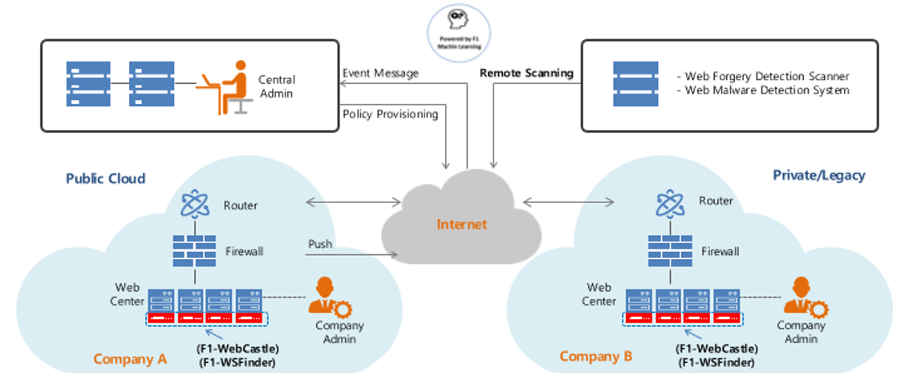
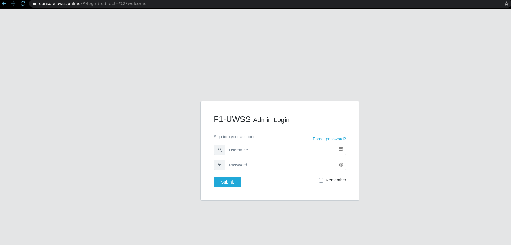
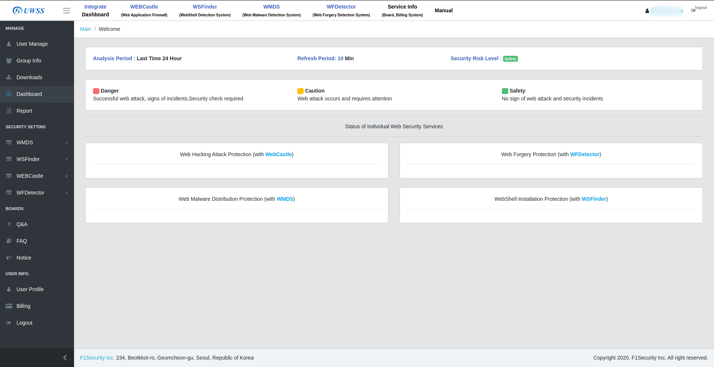
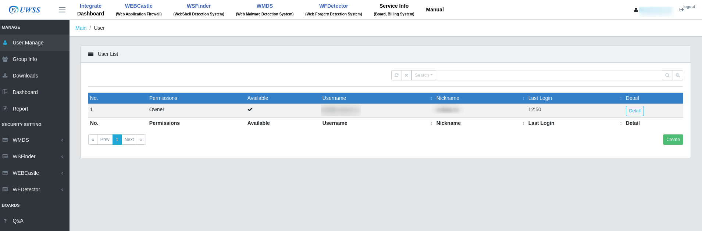
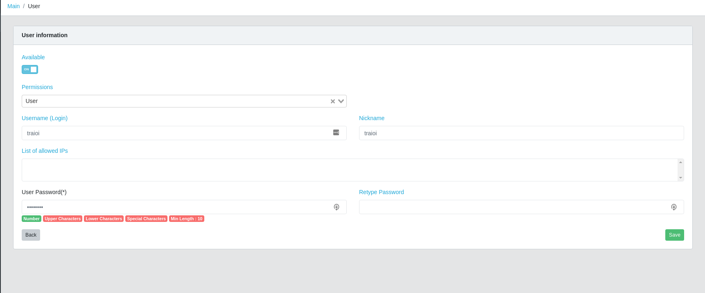
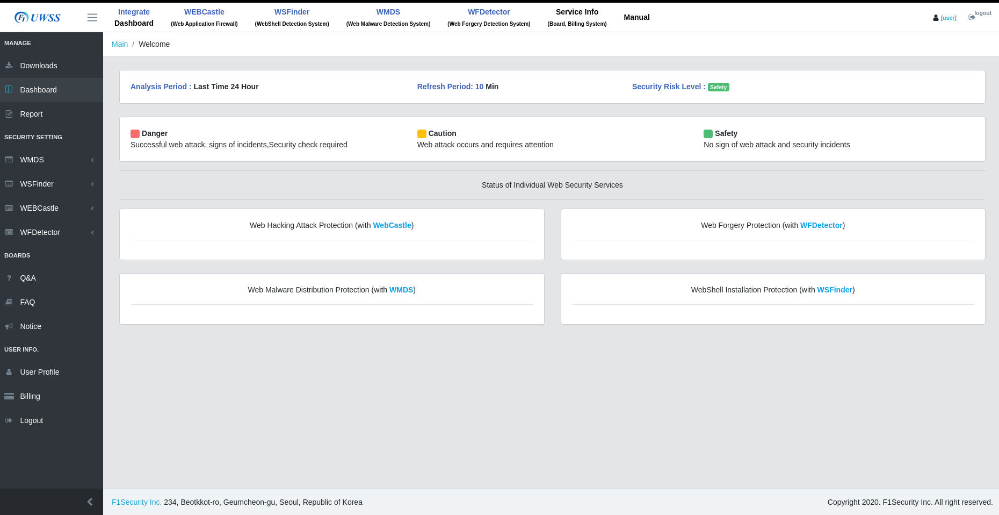
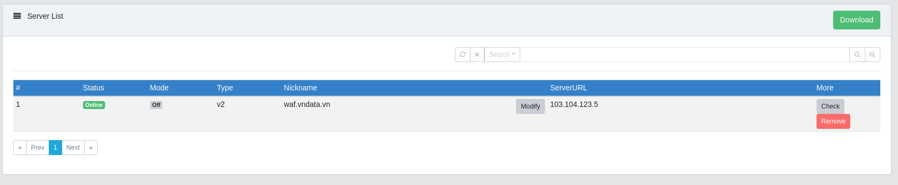

# F1-UWSS

> **Provider:** F1Security Corp  
> **Type:** SECaaS  
> **Website:** https://www.f1secaas.kr/  
> **Pricing:** https://www.f1secaas.kr/Pricing  

## 1. Tổng quan

### 1.1. F1Security Corp

#### Thông tin chung

* **Tên tổ chức:** F1security, Inc.
* **Địa chỉ:** Seoul, Hàn Quốc.
* **Năm thành lập:** 12/2020.
* **Quy mô:** 37.

#### Các sản phẩm

* **Dịch vụ tư vấn về bảo mật:**
	* ISMS, PIMS, ISO27001 certification consulting
	* Web penetration test and malware analysis
	* Privacy Consulting, Survey and analysis of information security trends
* **Dịch vụ/giải pháp về bảo mật Web:**
	* Web Firewall (F1-WebCon)
	* WebShell detection solution (F1-WSFinder)
	* Web Malware Diffusion Detection Solution(F1-WMDS)

### 1.2. F1–UWSS

**F1–UWSS** (**F1**Security - **U**nified **W**eb **S**ecurity **S**ervice):
* Dịch vụ bảo mật Website.
* Cloud platform.
* Bao gồm các sản phẩm của F1Security:
	* **WebCastle:** Detect và block các tấn công website.
	* **WSFinder:** Anti-Webshell, detect và remove web shell.
	* **WFDetector:** Detect các website giả mạo.
	* **WMDS:** Detect các đoạn mã độc trong website.

### 1.3. How it works



* **UWSS** sử dụng web firewall **WebCastle** agent detect và block các tấn công đến Website.
* Bên trong sẽ sử dụng **WSFinder** để detect về webshell đang tồn tại và xóa nếu được yêu cầu (hoặc tự động xóa).
* **WSFinder** sẽ hoạt động từ bên ngoài (remote scanning) để phát hiện các website giả mạo.
* **WMDS** sẽ tìm kiếm các đoạn mã độc bằng blackbox từ bên ngoài.

### 1.4. Function Preview

#### 1.4.1. Admin Panel Login

* **Admin Login:** https://console.uwss.online/



#### 1.4.2. Admin Panel Dashboard

* Dashboard gồm 4 phần chính:
	* **Manage:** Quản lý User, tổng hợp Monitor, Report.
	* **Security Setting:** Cấu hình các tính năng Security của F1-UWSS.
	* **Boards:** Ticket tương tác với người quản trị.
	* **User info.:** Các thông tin liên quan đến account đang login.



#### 1.4.3. Manage

##### a. User Manager Dashboard

* Cho phép thêm (Create), Sửa (Modify), Xóa (Delete) users.



##### b. User Manager (Create User)

* User sẽ có các tính năng tương ứng:
	* **Available:** Active hoặc Deactive user.
	* **Permissions:** Các quyền hạn của User.
		* **Monitor:** Quyền xem các monitor.
		* **User:** Giới hạn các quyền ở mức User.
		* **Billing:** Reseller.
		* **Owner:** Tương tự như admin.
	* **List of allowed IPs:** Giới hạn số lượng IPs tương ứng với User được phép vào Dashboard.
	* **User Password(\*):** Có các validation rõ ràng.



* **User** Permission:



* **Monitor** Permission: *Không login được*.
* **Billing** Permission:

## 2. Demo

### 2.1. Setup

* **Resources:**
	* **CPU:** 4 core
	* **RAM:** 8 GB
	* **Disk:** 50 GB
* **IP:** 103.104.123.5
* **Domain:** http://waf.vndata.vn/
* **Control Panel:** [VestaCP](https://vestacp.com/)
* **Source code:** [DVWA](http://www.dvwa.co.uk/)

### 2.2. Preparation

#### 2.2.1. WEBCastle

* Cài agent lên Web Server:

```
# export f1secaas=https://api.uwss.online && wget -qO- --no-check-certificate https://api.uwss.online/downloads/webcastle/v2/linux/x64/latest/installer.sh | bash -s nginx
========= INSTALL F1 WAF =========
SET UP INSTALL TYPE : nginx
[[Enter Username]]
...
[[Enter Password]]
Getting License
Add License
start ubuntu install script
IWAF Nginx DOWNLOAD
...
[+] Install Request f1-uwss[:waf] done
remove f1-uwss[:waf] tmp file
[+] chown waf to nobody:nobody
[+] Service nginx Restart OK
Starting iwaf...
iwaf is running with pid: 7244 7245
Starting iwafagent
-e iwaf agent is running with pid: 7283
iwaf install successfully

# netstat -nltp | grep -E '7244|7245|7283'
tcp        0      0 0.0.0.0:10020           0.0.0.0:*               LISTEN      7244/iwaf: m-p /opt
```

* **WEBCastle** trên Dashboard tự detect khi Agent được cài đặt xong.



## 3. Tổng kết

Hẹo do chưa gì cài agent vô hư luôn server.

```
# nginx -t
nginx: [emerg] malloc(94071447035673) failed (12: Cannot allocate memory)
Segmentation fault (core dumped)

# dmesg
...
[14388.307837] nginx[9856]: segfault at ffffffffffffffe0 ip 00007f651f33f507 sp 00007ffdcceecde8 error 5 in libc-2.27.so[7f651f1b1000+1e7000]
[14429.259131] nginx[9991]: segfault at ffffffffffffffe0 ip 00007f5301543507 sp 00007ffc23be7788 error 5 in libc-2.27.so[7f53013b5000+1e7000]
[14601.756257] nginx[10191]: segfault at ffffffffffffffe0 ip 00007fb885c2e507 sp 00007ffcbc5c1df8 error 5 in libc-2.27.so[7fb885aa0000+1e7000]
```
