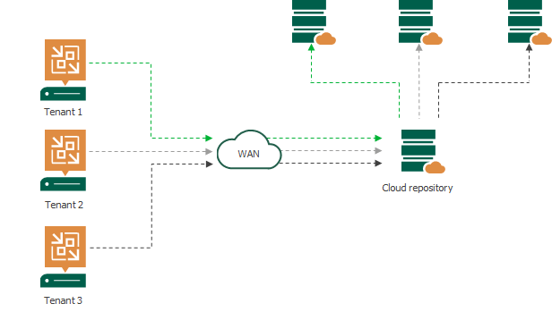
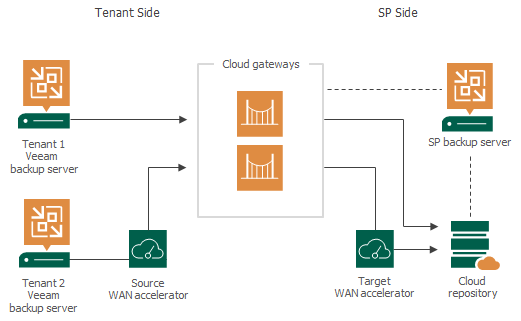

# Veeam Service Provider Console

## 1. Giải pháp Veeam

### 1.1. Veeam là gì?

**Veeam** là từ được tạo ra từ cách phát âm tiếng Anh chữ "VM" (virtual machine). Có nghĩa là các giải pháp của **Veeam** sẽ liên quan đến các vấn đề về các hạ tầng ảo hóa như Cloud, Virtual Machine, Hyper-V, ...

**Veeam** được phát triển bởi **Veeam Software**.

### 1.2. Veeam Cloud Connect

Các nhà cung cấp dịch vụ (Service Provider - SP) sử dụng **Veeam Backup & Replication** để cung cấp các giải pháp BaaS (Backup as a Service) hay DRaaS (Disaster Recovery as a Service) cho các khách hàng (Cloud). Hạ tầng **Veeam Cloud Connect** gồm 2 thành phần chính:
* **Cloud repositories:** Là storage chứa các backup của VMs, có thể sử dụng như primary storage locations và secondary storage locations để áp dụng giải pháp *3-2-1 backup*.
* **Replication resources:** Chứa compute, storage và network resources của hạ tầng SP.
  * Đối với SP: tính toán và cấu hình các hardware plans.
  * Đối với KH (cloud hosts): sử dụng VM trên cloud hosts và fail-over với VM replicas trên hạ tầng của SP.

*KH sẽ chứa dữ liệu trên Cloud hosts (của SP), connect đến hạ tầng của SP và ghi backups đến **Cloud repositories** hoặc **Replication resources** với VMs của họ.*

## 2. Veeam Cloud Connect

### 2.1. Veeam Cloud Connect Backup

#### 2.1.1. Overview
SP sử dụng **Veeam Backup & Replication** để phục vụ như 1 **Cloud repositories** để cung cấp cho khách hàng.

**Cloud repositories** có nhiều kiến trúc backup phù hợp với từng loại khách hàng khác nhau. **Veeam Backup & Replication** sẽ tạo ra 1 storage abstration layer và các phân vùng lưu trữ ảo của **Cloud repositories**. Do đó, SP có thể hiển thị tài nguyên trong "kho" cho từng khách hàng tương ứng, mỗi tài nguyên sẽ mỗi data isolated và segregated với nhau trong hạ tầng cloud của SP.

#### 2.1.2. Các tính năng

* Backup VM và physical machines đến **Cloud repository**.
* Copy backup files đến **Cloud repository**.
* Restore data từ **Cloud repository**.
* Perform file copy operations between the tenant side and the **Cloud repository** (manual only).

#### 2.1.3. Infrastructure

* **Phía SP:**
  * SP Veeam Backup Server:
    * Giữ vai trò cấu hình và điều khiển tập trung trong hạ tầng Veeam Cloud Connect.
    * Sử dụng **Veeam Cloud Connect Service** (Microsoft service) để tương tác với các thành phần trong hạ tầng:
      * Cung cấp cho KH các quyền truy cập vào Cloud repositories và Cloud hosts.
      * Controlling transport services that work with tenant cloud repositories and cloud hosts.
      * Giao tiếp với **Veeam Backup & Replication database**.
  * 1 hoặc nhiều Cloud Gateways:
    * Là **network appliance**.
    * **Veeam backup servers** ở phía KH sẽ không tương tác trực tiếp với Cloud repositories và Cloud hosts trên hạ tầng của SP, mà dữ liệu của KH phải tương tác và trung chuyển trong hạ tầng Cloud thông qua **Cloud Gateways**.
    * Sử dụng **Cloud Gateway Service**.
    * Có thể cài đặt trên cả VM và máy chủ vật lý chạy Microsoft Windows.
  * 1 hoặc nhiều Cloud Repositories.
    * Chứa VM data của KH.
    * Các loại backup mà **Cloud repositories** hỗ trợ:
      * Microsoft Windows
      * Linux
      * Shared folder
      * Deduplicating storage appliance: Dell EMC Data Domain, ExaGrid and Quantum DXi
  * 1 hoặc nhiều target WAN Accelerators:
    * Sử dụng **Veeam WAN Accelerator Service**.
    * Giúp KH tùy chỉnh các thao tác backup & replication qua:
      * Direct channel.
      * Giao tiếp với Cloud repositoriy.
      * Giao tiếp với Cloud hosts.
    * Có thể dùng nhiều **target WAN Accelerators** cho từng KH khác nhau.
* **Phía KH:**
  * KH Veeam Backup Server:
    * Tương tác với **SP Veeam Cloud Connect backup & replication** resources.
  * Source WAN Accelerator:
    * Sử dụng **Veeam WAN Accelerator Service**.
    * Giao tiếp với **target WAN Accelerators**.

## 3. Giải pháp BaaS

### 3.1. Overview

* Sử dụng **Veeam Cloud Connect Backup** cho VMs hoặc shared folder hạ tầng Cloud.

### 3.2. Components

#### 3.2.1. Cloud Gateways

* Mỗi **Cloud gateway** cần 1 dedicated IP public, sử dụng DNS round robin để load balance.
* Requirement:
  * **Service:** Cloud Gateway Service
  * **OS:** Microsoft Windows Server 2016/2019
  * **Hardware:**
    * **CPU:** x86 or x86-64 processor
    * **Memory:** 1 GB/2000 concurent connections
    * **Disk space:** 300 MB
    * **Network:** 1 Gbps LAN

#### 3.2.2. Cloud Connect

* **Cloud hosts**
* Requirement:
  * **Service:** Veeam Cloud Connect Service

#### 3.2.3. Backup & Replicate

* **Backup Server**
* Requirement:
  * **Service:** Veeam Backup Service
  * **OS:** Microsoft Windows Server 2016/2019
  * **Hardware:**
    * **CPU:** 4 cores
    * **Memory:** 4 GB, +500 MB/1 job
    * **Disk space:**
      * 5GB: product installation
      * 4.5 GB: Microsoft .NET Framework
      * 10 GB/100 VM
    * **Network:** 1 Gbps

#### 3.2.4. MSSQL Server

* Requirement:
  * **OS:** Microsoft Windows Server 2016/2019

#### 3.2.5. Active Directory (AD, DNS, NTP)

* Requirement:
  * **OS:** Microsoft Windows Server 2016/2019

#### 3.2.6. Backup Repository Server

* **Cloud repository**
* Requirement:
  * **Service:**
  * **OS:** Microsoft Windows Server 2016/2019
  * **Hardware:**
    * **CPU:** x86-64 processor, 1 task/1 core
    * **Memory:** 2 GB/1 CPU core *[4]*
    * **Network:** 1 Gbps

#### 3.2.7. Storage

## Keywords

* **3-2-1 backup:**

## References

* [1] https://helpcenter.veeam.com/docs/backup/cloud/cloud_overview.html
* [2] https://helpcenter.veeam.com/docs/backup/cloud/cloud_backup.html
* [3] https://helpcenter.veeam.com/docs/backup/cloud/system_requirements.html
* [4] https://helpcenter.veeam.com/docs/backup/vsphere/limiting_tasks.html?ver=100#repo