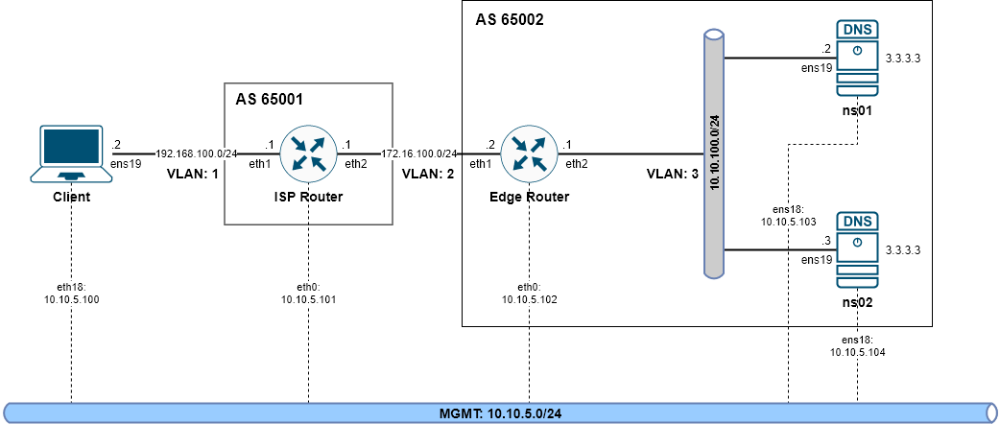

# Nghiên cứu về giải pháp Anycast

## 1. Pre-tasks


## 2. Lab

### 2.1. Topology



* **ISP Router:** Như cái tên.
* **Edge Router:** Gateway, kết nối ngang hàng BGP với to nameservers.
* **ns01, ns02:** Server chứa backend services.
* **Client:** Test routing và load balancing.

* **How it work?**
  * `AS 65001` tượng trưng cho ASN của ISP.
  * `AS 65002` tương trung cho ASN nội bộ phía sau **Edge Router**.
  * **WAN BGP:** `172.16.100.0/24` được sử dụng cho BGP session giữa **ISP Router** và **Edge Router**.
  * **LAN BGP:** `10.10.100.0/24` được sử dụng cho BGP session giữa **Edge Router** và các service ở backend.
    * **ns01** và **ns02** sẽ có chung IP Public `3.3.3.3/32` và được route đến **LAN BGP**.
    * Incomming traffic từ **Client** sẽ đi vào **ns01** hoặc **ns02** đến IP `3.3.3.3`.

### 2.2. ISP Router

* **Environment:** VyOS 1.4

* **Interfaces configurations:**
```
vyos@vyos:~$ show interfaces 
Codes: S - State, L - Link, u - Up, D - Down, A - Admin Down
Interface        IP Address                        S/L  Description
---------        ----------                        ---  -----------
eth0             10.10.5.101/24                    u/u  
eth1             192.168.100.1/24                  u/u  
eth2             172.16.100.1/24                  u/u  
lo               127.0.0.1/8                       u/u  
                 ::1/128
```

* **BGP Configuration:**
```
$ config
# set protocols bgp local-as 65001
# set protocols bgp neighbor 172.16.100.2 remote-as 65002
# set protocols bgp neighbor 172.16.100.2 update-source 172.16.100.1
# set protocols bgp parameters router-id 172.16.100.1
# commit
# save
```

### 2.3. Edge Router

* **Environment:** VyOS 1.4

* **Interfaces configurations:**
```
vyos@vyos:~$ show interfaces 
Codes: S - State, L - Link, u - Up, D - Down, A - Admin Down
Interface        IP Address                        S/L  Description
---------        ----------                        ---  -----------
eth0             10.10.5.102/24                    u/u  
eth1             172.16.100.2/24                   u/u  
eth2             10.10.100.1/24                    u/u  
lo               127.0.0.1/8                       u/u  
                 ::1/128
```

* **BGP Configuration:**
```
$ config
# set protocols bgp local-as 65002
# set protocols bgp parameters bestpath as-path multipath-relax
# set protocols bgp neighbor 10.10.100.2 remote-as 65002
# set protocols bgp neighbor 10.10.100.2 update-source 10.10.100.1
# set protocols bgp neighbor 10.10.100.3 remote-as 65002
# set protocols bgp neighbor 10.10.100.3 update-source 10.10.100.1
# set protocols bgp neighbor 172.16.100.1 remote-as 65001
# set protocols bgp neighbor 172.16.100.1 update-source 172.16.100.2
# set protocols bgp parameters router-id 172.16.100.2
# commit
# save
```

### 2.4. ns01, ns02

* **Environment:** Ubuntu 20.04

#### Setup card loopback

```
# cat /etc/netplan/00-installer-config.yaml
..
    lo:
        addresses:
            - 127.0.0.1/8
            - 3.3.3.3/32
..

# netplan apply
```

#### Cài đặt `bird`.

```
# apt install bird -y
```

```
# vi /etc/bird.conf
router id 10.10.100.2;
protocol kernel {
        persist;
        scan time 20;
        export all;
}

protocol device {
        scan time 10;
}

protocol static {
}

protocol static static_bgp {
        import all;
        route 3.3.3.3/32 reject;
}

protocol bgp {
        local as 65002;
        neighbor 10.10.100.1 as 65002;
        import none;
        export where proto = "static_bgp";
}
```

#### Setup Nginx

```
# apt install nginx -y
```

* Ở server **ns01**
```
echo "Server 1" > /var/www/html/index.html
```

* Ở server **ns02**
```
echo "Server 2" > /var/www/html/index.html
```

## 3. Result

### ISP Router

* Dùng lệnh `show ip bgp` sẽ thấy IP `3.3.3.3` đã được route từ **Edge Router** sang.
```
vyos@isp-router:~$ show ip bgp
BGP table version is 4, local router ID is 172.168.100.1, vrf id 0
Default local pref 100, local AS 65001
Status codes:  s suppressed, d damped, h history, * valid, > best, = multipath,
               i internal, r RIB-failure, S Stale, R Removed
Nexthop codes: @NNN nexthop's vrf id, < announce-nh-self
Origin codes:  i - IGP, e - EGP, ? - incomplete

   Network          Next Hop            Metric LocPrf Weight Path
*> 3.3.3.3/32       172.16.100.2                           0 65002 i
*> 192.168.100.0/24 0.0.0.0                  0         32768 i

Displayed  2 routes and 2 total paths
```

* Dùng lệnh `show ip route 3.3.3.3` cũng sẽ ra kết quả tương tự
```
vyos@isp-router:~$ show ip route 3.3.3.3
Routing entry for 3.3.3.3/32
  Known via "bgp", distance 20, metric 0, best
  Last update 00:45:08 ago
  * 172.16.100.2, via eth2, weight 1
```

### Edge Router

* Dùng lệnh `show ip bgp` sẽ thấy IP `3.3.3.3` đã được route từ **ns01** và **ns02** sang.
```
vyos@edge-router:~$ show ip bgp
BGP table version is 5, local router ID is 172.16.100.2, vrf id 0
Default local pref 100, local AS 65002
Status codes:  s suppressed, d damped, h history, * valid, > best, = multipath,
               i internal, r RIB-failure, S Stale, R Removed
Nexthop codes: @NNN nexthop's vrf id, < announce-nh-self
Origin codes:  i - IGP, e - EGP, ? - incomplete

   Network          Next Hop            Metric LocPrf Weight Path
*=i3.3.3.3/32       10.10.100.3                   100      0 i
*>i                 10.10.100.2                   100      0 i
*> 192.168.100.0/24 172.16.100.1             0             0 65001 i

Displayed  2 routes and 3 total paths
```

* Dùng lệnh `show ip route 3.3.3.3` cũng sẽ ra kết quả tương tự
```
vyos@edge-router:~$ show ip route 3.3.3.3
Routing entry for 3.3.3.3/32
  Known via "bgp", distance 200, metric 0, best
  Last update 00:54:52 ago
  * 10.10.100.2, via eth2, weight 1
  * 10.10.100.3, via eth2, weight 1
```

### Client

* Dùng lệnh `traceroute 3.3.3.3` để xem đường đi từ client đến endpoint.
```
# traceroute 3.3.3.3
traceroute to 3.3.3.3 (3.3.3.3), 30 hops max, 60 byte packets
 1  _gateway (192.168.100.1)  0.280 ms  0.246 ms  0.211 ms
 2  172.16.100.2 (172.16.100.2)  0.621 ms  0.637 ms  0.526 ms
 3  3.3.3.3 (3.3.3.3)  0.860 ms  0.809 ms  0.760 ms
```

* Dùng lệnh `curl` để xem kết quả trả về từ server.
```
# curl 3.3.3.3
Server 1
```

* Đổi IP client thành `192.168.100.3` rồi dùng lệnh `curl` lần nữa.
```
# curl 3.3.3.3
Server 2
```

