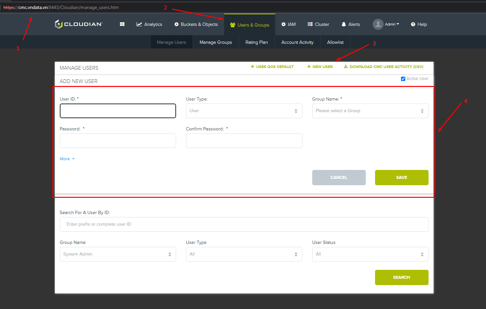
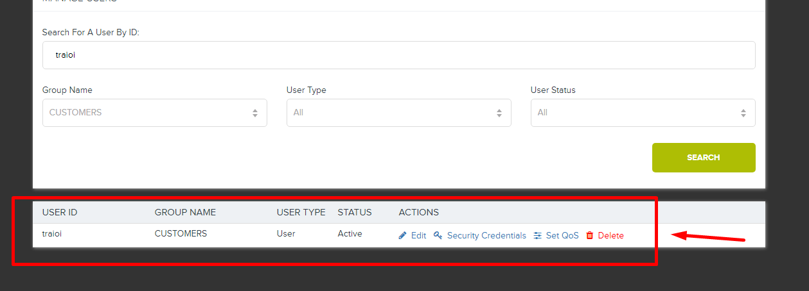
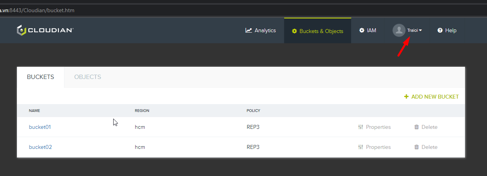
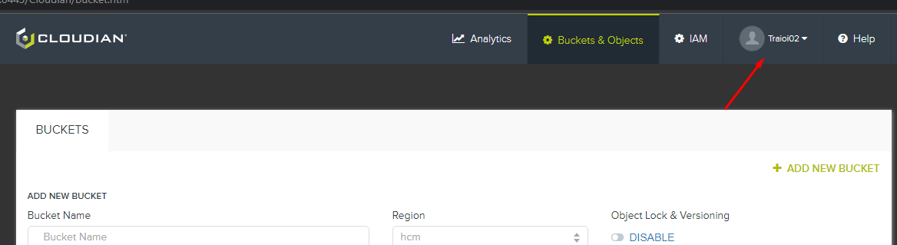

# Khởi tạo users

## 1. Khởi tạo bằng WebGUI

### Khởi tạo

* **Bước 1:** Truy vào link https://cmc.vndata.vn:8443/
* **Bước 2:** Chọn tab **Users & Groups**
* **Bước 3:** Chọn **+ NEW USER**
* **Bước 4:** Điền các thông tin cần thiết và chọn **Save**



### Kết quả từ Admin Console



### Kết quả khi đăng nhập User Console



## 2. Khởi tạo bằng API

### Syntax

```
PUT /user
POST /user/password?userId=string&groupId=string&password=string[&oldpassword=string]
```

| `PUT /user` required request payload is a JSON-formatted *UserInfo* object.

```
# cat traioi.txt 
{
  "active": "true",
  "address1": "",
  "address2": "",
  "city": "",
  "country": "",
  "emailAddr": "traioi02@vndata.vn",
  "fullName": "TraiOi 02",
  "groupId": "CUSTOMERS",
  "ldapEnabled": false,
  "phone": "",
  "state": "",
  "userId": "traioi02",
  "userType": "User",
  "website": "",
  "zip": ""
}
```

### Example Using cURL

* Create User
``` 
# curl -X PUT -H "Content-Type: application/json" -k -u 'sysadmin:GmgXeigJ7koM6mGe' -d @traioi.txt https://s3-admin.vndata.vn:19443/user | python -mjson.tool
{
    "active": "true",
    "address1": "",
    "address2": "",
    "canonicalUserId": "998f314d91208bf0b9822b689e42f494",
    "city": "",
    "country": "",
    "emailAddr": "traioi02@vndata.vn",
    "fullName": "TraiOi 02",
    "groupId": "CUSTOMERS",
    "ldapEnabled": false,
    "phone": "",
    "state": "",
    "userId": "traioi02",
    "userType": "User",
    "website": "",
    "zip": ""
}
```

* Create password for new user

```
# curl -X POST -k -u 'sysadmin:GmgXeigJ7koM6mGe' 'https://s3-admin.vndata.vn:19443/user/password?userId=traioi02&groupId=CUSTOMERS&password=Traioi@123'
```

### Kết quả

* Đăng nhập vào https://cmc.vndata.vn:8443/Cloudian/ bằng:
  * **Username:** traioi02
  * **Password:** Traioi@123

